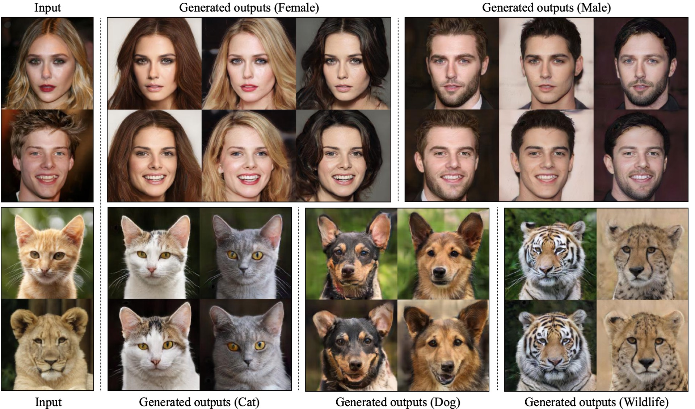
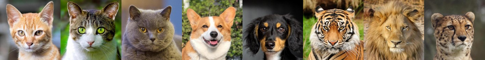

## StarGAN v2 - Official PyTorch Implementation

<p align="left"></p>

This repository provides the official PyTorch implementation of the following paper:
> **StarGAN v2: Diverse Image Synthesis for Multiple Domains**<br>
> [Yunjey Choi](https://github.com/yunjey)\*, [Youngjung Uh](https://github.com/youngjung)\*, [Jaejun Yoo](http://jaejunyoo.blogspot.com/search/label/kr)\*, [Jung-Woo Ha](https://www.facebook.com/jungwoo.ha.921)<br>
> Clova AI Research, NAVER Corp. (* indicates equal contribution)<br>
> https://arxiv.org/abs/1912.01865
>
> **Abstract:** *A good image-to-image translation model should learn a mapping between different visual domains while satisfying the following properties: 1) diversity of generated images and 2) scalability over multiple domains. Existing methods address either of the issues, having limited diversity or multiple models for all domains. We propose StarGAN v2, a single framework that tackles both and shows significantly improved results over the baselines. Experiments on CelebA-HQ and a new animal faces dataset (AFHQ) validate our superiority in terms of visual quality, diversity, and scalability. To better assess image-to-image translation models, we release AFHQ, high-quality animal faces with large inter- and intra-domain variations. The code, pretrained models, and dataset will be released for reproducibility.*

## Results
StarGAN v2 can transform a source image into an output image reflecting the style (e.g., hairstyle and makeup) of a given reference image. Additional high-quality videos can be found [here](https://twitter.com/yunjey_choi).

<p align="left"></p>

## Animal Faces-HQ dataset (AFHQ)

<p align="left"></p>

We release a new dataset of animal faces, Animal Faces-HQ (AFHQ), consisting of 15,000 high-quality images at 512×512 resolution. The figure above shows example images of the AFHQ dataset. The dataset includes three domains of cat, dog, and wildlife, each providing about 5000 images. By having multiple (three) domains and diverse images of various breeds per each domain, AFHQ sets a challenging image-to-image translation problem. For each domain, we select 500 images as a test set and provide all remaining images as a training set. To download the dataset, run the command below.


```bash
cd stargan-v2
bash download.sh afhq
```

## License
The source code, pretrained models, and dataset will be available under [Creative Commons BY-NC 4.0](https://creativecommons.org/licenses/by-nc/4.0/) license by NAVER Corporation. You can **use, copy, tranform and build upon** the material for **non-commercial purposes** as long as you give **appropriate credit** by citing our paper, and indicate if changes were made.


## Installation
The code and usage examples will be updated soon. Please stay tuned.

## Citation
If you find this work useful for your research, please cite our paper:
```
@article{choi2019starganv2,
  title={StarGAN v2: Diverse Image Synthesis for Multiple Domains},
  author={Yunjey Choi and Youngjung Uh and Jaejun Yoo and Jung-Woo Ha},
  journal={arXiv preprint arXiv:1912.01865},
  year={2019}
}
```
